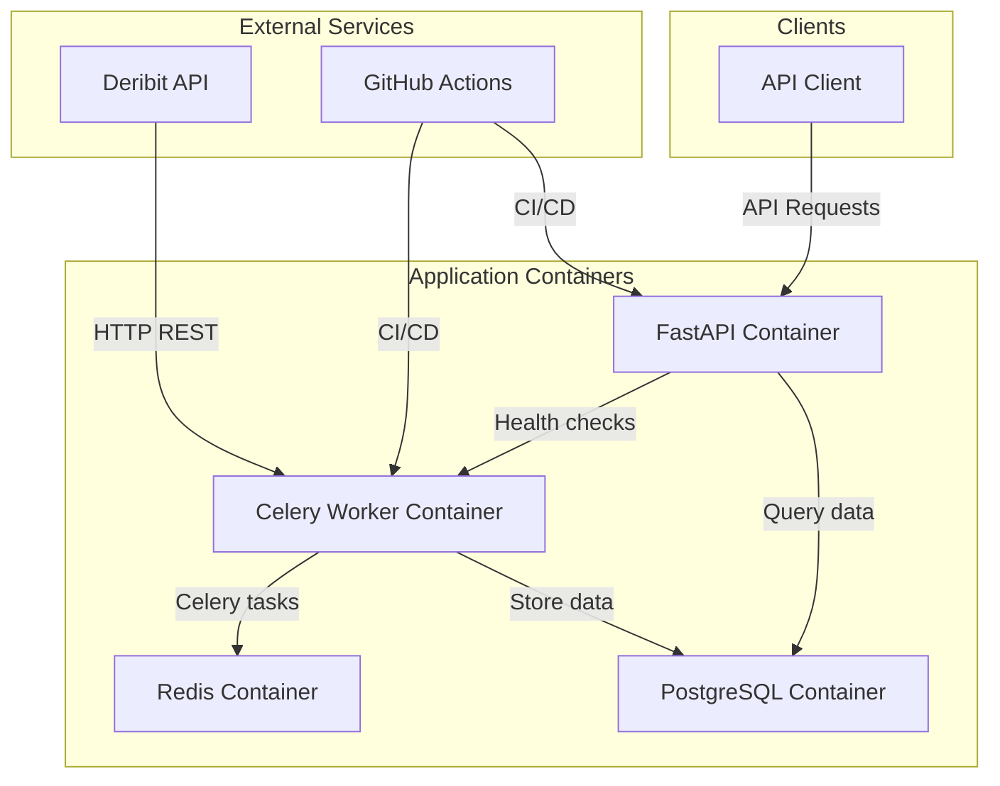

# Deribit Storage - Architecture Plan

## Project Overview
A Python-based application that fetches cryptocurrency prices from Deribit exchange every minute and provides REST API endpoints to query the stored data.

## Technology Stack

### Core Technologies
- **Python 3.11+** - Primary programming language
- **FastAPI** - Web framework for building APIs
- **SQLAlchemy 2.0** - ORM for database operations
- **PostgreSQL 15** - Primary database
- **Celery** - Distributed task queue for periodic tasks
- **Redis** - Message broker for Celery
- **aiohttp** - Asynchronous HTTP client for Deribit API
- **Docker & Docker Compose** - Containerization and orchestration
- **GitHub Actions** - CI/CD pipeline

### Authentication & Security
- **Client Credentials** (Client ID + Client Secret) for API authentication
- **Pydantic Settings** for configuration management
- **Rate limiting** using FastAPI-Limiter
- **Environment variables** for sensitive data

### Monitoring & Logging
- **JSON-structured logging** for better log aggregation
- **Log level**: INFO by default, DEBUG for development
- **Health check endpoints** for monitoring
- **Prometheus metrics** (optional extension)

## System Architecture

### Component Diagram


### Container Architecture
1. **API Container** (FastAPI application)
   - FastAPI web server (Uvicorn)
   - API endpoints with authentication
   - Rate limiting middleware
   - Swagger/OpenAPI documentation

2. **Worker Container** (Celery worker)
   - Periodic price fetching tasks (every minute)
   - aiohttp client for Deribit API
   - Error handling and retry logic

3. **Redis Container**
   - Message broker for Celery
   - Result backend for task results
   - Rate limiting storage

4. **PostgreSQL Container**
   - Primary data storage
   - Price history table
   - Indexes for performance optimization

## Data Flow

1. **Price Collection** (Every minute):
   ```
   Celery Beat Scheduler → Celery Worker → Deribit API → PostgreSQL
   ```

2. **API Data Retrieval**:
   ```
   Client → FastAPI (Auth) → SQLAlchemy → PostgreSQL → Client
   ```

## Database Schema

### Tables
1. **price_history**
   - `id` (UUID, Primary Key)
   - `ticker` (VARCHAR, e.g., "btc_usd", "eth_usd")
   - `price` (DECIMAL(20, 8), index price)
   - `timestamp` (BIGINT, UNIX timestamp from Deribit)
   - `created_at` (TIMESTAMP WITH TIME ZONE, record creation time)

### Indexes
- Composite index on `(ticker, timestamp)` for date-filtered queries
- Index on `timestamp` for time-based queries
- Index on `ticker` for ticker-specific queries

## API Design

### Endpoints
All endpoints require `ticker` query parameter and authentication.

1. **GET /api/v1/prices**
   - Returns all stored prices for a given ticker
   - Query parameters: `ticker`, `limit`, `offset`
   - Response: List of price objects with pagination metadata

2. **GET /api/v1/prices/latest**
   - Returns the latest price for a given ticker
   - Query parameters: `ticker`
   - Response: Single price object

3. **GET /api/v1/prices/filter**
   - Returns prices filtered by date range
   - Query parameters: `ticker`, `start_date`, `end_date`
   - Response: List of price objects within date range

4. **GET /health**
   - Health check endpoint
   - Returns service status and dependencies health

5. **GET /metrics**
   - Prometheus metrics endpoint (optional)

### Authentication
- Client credentials (Client ID + Client Secret) passed in headers
- `X-Client-ID` and `X-Client-Secret` headers
- Middleware validates credentials against environment variables
- Rate limiting per client ID
- Credentials stored in `.env` file (not database)

## Project Structure
```
deribit-storage/
├── src/
│   ├── api/
│   │   ├── __init__.py
│   │   ├── main.py              # FastAPI app
│   │   ├── routers/
│   │   │   ├── __init__.py
│   │   │   ├── prices.py        # Price endpoints
│   │   │   └── health.py        # Health check endpoints
│   │   ├── dependencies/
│   │   │   ├── __init__.py
│   │   │   ├── auth.py          # Authentication dependencies
│   │   │   └── database.py      # Database session dependency
│   │   ├── middleware/
│   │   │   ├── __init__.py
│   │   │   └── rate_limit.py    # Rate limiting middleware
│   │   └── schemas/
│   │       ├── __init__.py
│   │       ├── price.py         # Pydantic models for prices
│   │       └── auth.py          # Authentication schemas
│   ├── worker/
│   │   ├── __init__.py
│   │   ├── tasks.py             # Celery tasks
│   │   ├── deribit_client.py    # Deribit API client
│   │   └── models.py            # SQLAlchemy models
│   ├── core/
│   │   ├── __init__.py
│   │   ├── config.py            # Pydantic settings
│   │   ├── database.py          # Database connection
│   │   ├── logging.py           # Logging configuration
│   │   └── security.py          # Security utilities
│   └── tests/
│       ├── __init__.py
│       ├── test_api.py          # API tests
│       ├── test_worker.py       # Worker tests
│       └── conftest.py          # Test fixtures
├── docker/
│   ├── Dockerfile.api
│   ├── Dockerfile.worker
│   └── docker-compose.yml
├── .github/
│   └── workflows/
│       ├── ci.yml               # CI pipeline
│       └── cd.yml               # CD pipeline
├── requirements/
│   ├── base.txt                 # Base dependencies
│   ├── api.txt                  # API dependencies
│   ├── worker.txt               # Worker dependencies
│   └── dev.txt                  # Development dependencies
├── .env.example                 # Environment variables template
├── .gitignore
├── pyproject.toml               # Python project configuration
├── README.md
├── docker-compose.yml
└── ТЗ.md                       # Requirements document
```

## Design Decisions & Justifications

### 1. Python & FastAPI Choice
- **FastAPI** provides automatic OpenAPI documentation, async support, and excellent performance
- **Python** ecosystem has mature libraries for financial data processing
- **SQLAlchemy 2.0** offers async support and type hints
- **Pydantic** ensures data validation and serialization

### 2. Microservices Architecture
- Separation of concerns: API service vs worker service
- Independent scaling of components
- Better fault isolation
- Clear separation of synchronous (API) and asynchronous (worker) workloads

### 3. PostgreSQL over NoSQL
- Structured data with clear schema (ticker, price, timestamp)
- ACID compliance for financial data
- Excellent performance for time-series queries with proper indexing
- Mature ecosystem and tooling

### 4. Celery for Periodic Tasks
- Robust task queue with scheduling capabilities
- Built-in retry mechanisms
- Monitoring and management tools (Flower)
- Integration with Redis as message broker

### 5. aiohttp for HTTP Client
- Asynchronous HTTP client for better performance
- Non-blocking I/O for concurrent requests
- Lightweight compared to requests+threading
- Native async/await support

### 6. JSON Structured Logging
- Machine-readable logs for aggregation systems
- Consistent log format across services
- Easy integration with log collectors (ELK stack, Loki)
- Better debugging with structured context

### 7. Containerization with Docker
- Consistent environment across development and production
- Easy deployment and scaling
- Isolation of services
- Simplified dependency management

### 8. GitHub Actions for CI/CD
- Native integration with GitHub repositories
- Free for public repositories
- Extensive marketplace of actions
- YAML-based configuration

### 9. HTTP over WebSockets for Deribit API
- Simpler implementation and error handling
- No need for persistent connections
- Adequate for 1-minute polling interval
- Lower resource consumption
- Easier to test and mock

## Implementation Phases

### Phase 1: Foundation
1. Project setup and virtual environment
2. Database schema design and migration
3. Basic FastAPI skeleton
4. Configuration management with Pydantic

### Phase 2: Core Functionality
1. Deribit HTTP client implementation
2. Celery task for price fetching
3. Basic API endpoints
4. Authentication system

### Phase 3: Production Readiness
1. Rate limiting middleware
2. Comprehensive logging
3. Health checks and monitoring
4. Error handling and retry logic

### Phase 4: Deployment
1. Docker containerization
2. Docker Compose configuration
3. GitHub Actions CI/CD pipeline
4. Environment-specific configurations

### Phase 5: Testing & Documentation
1. Unit tests for all components
2. Integration tests
3. Swagger/OpenAPI documentation
4. README with setup instructions

## Next Steps
1. Set up Python project structure with virtual environment
2. Create database models and migrations
3. Implement Deribit client with aiohttp
4. Create Celery task scheduler
5. Implement FastAPI endpoints with authentication
6. Add comprehensive logging and monitoring
7. Write unit tests
8. Create Docker configuration
9. Set up CI/CD pipeline
10. Deploy and test